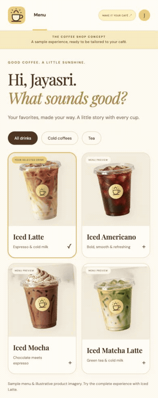
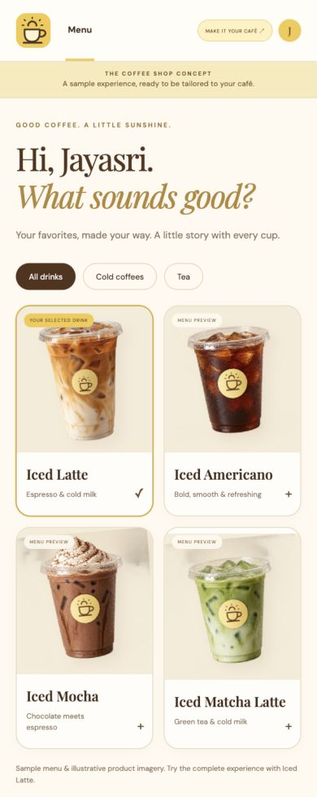
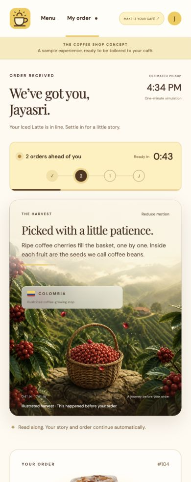
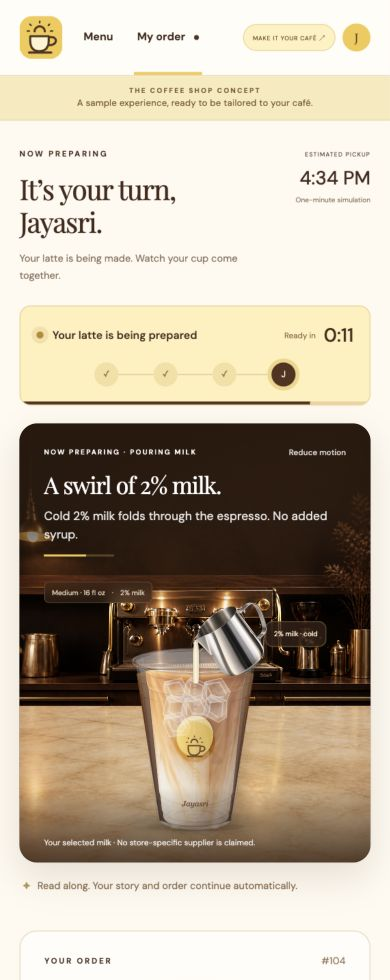
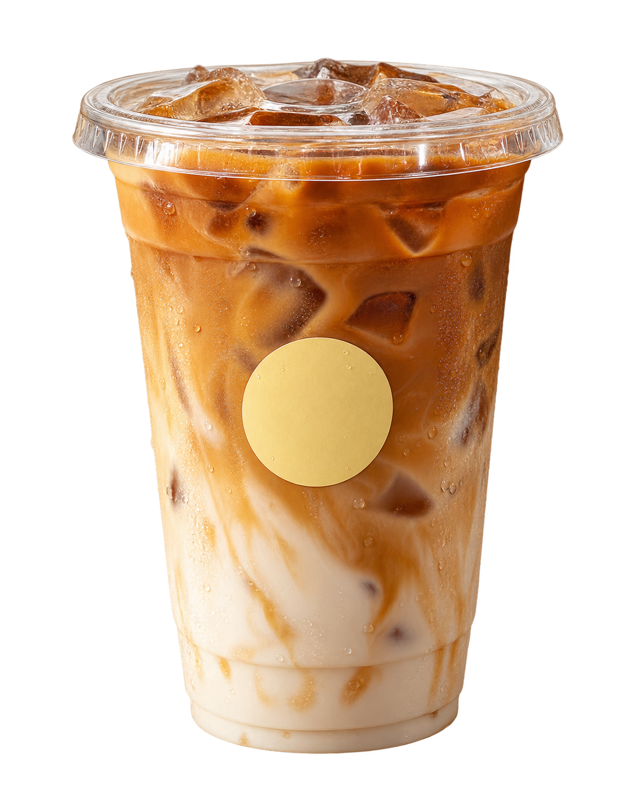

<p align="center">
  
</p>

# Coffee Shop Experience

**What if the wait for your coffee became part of the reason you came back?**

A customizable café ordering concept by [Jayasri](https://github.com/jayasrisng). Order once, then watch a silent, animated story unfold while your drink moves from the queue to pickup.

> A concept prototype. No real orders, payments, live café tracking, or verified recipe nutrition.

## Watch the experience

These are captures of the working browser prototype, including its live countdown and automatic pickup transition.

<p align="center">
  
</p>

The GIF plays at **2× speed**. [Download the full walkthrough video](docs/portfolio/order-walkthrough.mp4) to see the one-minute order in real time. Both are silent screen captures; the product artwork inside the app is generated concept imagery.

<table>
  <tr>
    <td><br><sub>A familiar beginning</sub></td>
    <td><br><sub>A story while you wait</sub></td>
    <td><br><sub>Your cup coming together</sub></td>
  </tr>
</table>

[Pickup screen](docs/portfolio/mobile-pickup.png) · [Brand preview](docs/portfolio/brand-preview.png) · [Portfolio media details](docs/portfolio/README.md)

## My story: the moment after “Order”

Waiting for coffee can be annoying. You have already chosen your drink, placed the order, and started wondering how long it will take. A pickup time gives you information, but there is still an empty moment between ordering and receiving your cup.

I wanted to explore what a café could do with that moment.

Instead of asking people to tap through another set of pages, what if the experience continued naturally? Three orders ahead of you. Then two. Then one. While you wait, a short story introduces the ingredients, the people and places behind them, and the care that goes into preparing your drink.

My first idea was an experience for a familiar coffee brand. As I developed it, I realized the opportunity was broader: an independent café should be able to tell its own story, in its own colors, with its own menu and sourcing information. That became **Coffee Shop Experience**.

The goal is to turn waiting into a chance to connect. A café could introduce its roaster, explain why it chose a particular milk, or help a customer understand what is in their usual order. Small, relevant details can make the experience feel more personal.

Trust is the ambition, not a result I am claiming to have measured. A beautiful animation cannot establish ingredient safety or prove where a cup came from. To earn trust, the story has to be supported by the café’s actual sourcing, ingredient, and preparation information. This prototype makes room for that information without inventing it.

## The experience

1. **Start with a familiar menu.** The customer browses drinks and chooses an Iced Latte.
2. **Make it personal.** Choose cup size, milk, espresso shots, vanilla sweetness, and ice. The demo order is made for Jayasri.
3. **Order once.** A one-minute simulation starts automatically. No “Next” or “Mark ready” buttons.
4. **Follow the story.** A portrait 4:5 animation moves through an illustrated coffee harvest, grinding, ice, espresso, milk, and a final cup check.
5. **Pick up your moment.** The finished cup appears with the customer’s name, order details, and a space for the café’s verified nutrition information.

The experience is silent, with readable text over the animation. A reduced-motion control and the device’s motion preference are respected. Looking at ingredients does not pause the order.

<table>
  <tr>
    <td align="center"><br><sub>An illustrated origin story</sub></td>
    <td align="center"><br><sub>A photographic-style finished cup</sub></td>
  </tr>
</table>

*Generated concept artwork, not photographs or live footage from a real café.*

## How your café could use it

This is designed as a starting point for a café-specific experience. A tailored version could carry your logo, colors, menu, ingredient story, pickup instructions, and verified recipe information.

Try **Make it your café** in the header to preview a café name and two accent colors. These changes stay in the current page only; they are not submitted or saved. The original concept logo stays in place during this preview.

The customer already has a reason to look at their order. That gives a café an opportunity to share something worth reading, while keeping queue status and pickup information visible. The story should remain short, accessible, and optional in a production experience.

Currently, only the **Iced Latte** has a complete ordering flow. Americano, mocha, and matcha are menu previews. This is a prototype I can adapt for interested cafés, rather than a claim that a full commercial ordering platform is already integrated.

## How I built it

I built the prototype with **Codex as an AI coding collaborator**, iterating from the initial idea into a working browser experience. I refined the automatic queue, corrected the personalization, removed voice narration, moved the story over the animation, introduced a 4:5 format, and then redesigned the project as a brand-neutral yellow-and-brown café concept.

I kept the runtime small so the experience is easy to run, inspect, and adapt.

| Tool / technology | What I used it for |
| --- | --- |
| HTML5 | Menu, order status, customization forms, and native dialogs |
| CSS3 | Responsive layouts, the 4:5 story frame, colors, transitions, and keyframe animation |
| Vanilla JavaScript with ES modules | Menu interactions, recipe state, branding preview, and automatic order progression |
| JSON | The sequence of story phases, timing boundaries, and written captions |
| SVG | The original logo, product decals, liquid masks, and layered preparation visuals |
| Built-in image generation | Cup cutouts, a masked plastic cup shell, metal pitcher, menu products, and café/farm scenes |
| Codex in-app browser tools | Visual review, mobile/desktop checks, and order-flow verification |
| FFmpeg | Encoding actual browser screenshots into a GIF and a shareable MP4 |
| Node.js built-in test runner | Timeline boundaries, recipe validation, and order restoration tests |
| Python standard-library HTTP server | Local development server |
| Git and GitHub | Version control and project sharing |

There is **no frontend framework, bundler, backend, or AI API call at runtime**. Generated artwork is stored in the repository. Google Fonts is the only external styling resource, with system-font fallbacks.

### A clock-driven order, not a chain of screens

The queue and story derive from elapsed wall-clock time. `timeline.mjs` takes the phase list, order start time, and current time, then returns the current phase, remaining seconds, progress, and readiness.

```js
const state = orderState(phases, startedAt, Date.now());
```

This keeps the simulation aligned if callbacks are delayed or the customer returns from a background tab. The start time and validated recipe choices are stored in the URL fragment, allowing a reload to restore a demo order for up to 24 hours without cookies or local storage.

| Elapsed time | What the customer sees |
| --- | --- |
| 0–10 seconds | Three orders ahead; an illustrated Colombian coffee hillside |
| 10–20 seconds | Two orders ahead; ripe coffee cherries travel toward a basket |
| 20–30 seconds | One order ahead; roasted beans in a grinder and grounds ready for espresso |
| 30–35 seconds | Preparation begins; ice goes into the open cup (or is skipped) |
| 35–44 seconds | The selected espresso shots pour over the ice |
| 44–54 seconds | Selected cold milk and optional vanilla sweetness |
| 54–60 seconds | Full cup and final check before pickup |
| 60 seconds | Automatic pickup screen |

### Layered visuals that respond to the order

The story combines generated background plates with photorealistic coffee cherries, a harvest basket that fills, a realistic grinder with beans in its hopper, and a photographic clear-plastic cup. In `pouring.mjs`, SVG clipping masks reveal the liquid inside the cup as it fills. A photographic stainless-steel pitcher pours espresso or milk, while CSS animates liquid blending and ice. Reflection layers keep the cup visible throughout preparation. The liquid reaches close to the rim, leaving a small gap. A final cup check replaces the earlier falling-lid effect. This is a composited product animation, not a physically simulated 3D fluid or footage from a real café.

Preparation visuals respond to the selected recipe. Photorealistic generated cups also appear in the menu, receipt, and pickup, including a separate no-ice cutout.

The imagery is representative, not a precise rendering of every quantity or ingredient formulation. [The artwork prompts](assets/COFFEE-SHOP-PROMPTS.md) document the visual process.

## Run locally

Clone this repository, enter its directory, and start a static server:

```sh
git clone https://github.com/jayasrisng/coffee-shop-experience.git
cd coffee-shop-experience
python3 -m http.server 4173 --bind 127.0.0.1
```

Open **http://localhost:4173**. No package installation or build step is required. Serve the project over HTTP; opening `index.html` directly does not provide the environment needed for module loading and JSON fetches.

To run the checks, use Node.js with its built-in test runner:

```sh
node --test *.test.mjs
node --check app.js
node --check visuals.mjs
```

The eight automated tests cover recipe options and normalization, URL restoration, the 3 → 2 → 1 queue, preparation boundaries, completion at 60 seconds, delayed callbacks, clock clamping, and contiguous story phases. Browser checks cover branding previews, mobile layout, silent playback, a customized order, and pickup.

## Project map

```text
.
├── index.html                 # Menu, order, pickup, and dialogs
├── styles.css                 # Responsive layout and animation
├── app.js                     # UI interactions and order orchestration
├── brand.mjs                  # Default café identity and accents
├── customization.mjs          # Recipe options and URL validation
├── customization.test.mjs
├── timeline.json              # Written story and phase boundaries
├── timeline.mjs               # Clock-derived order state
├── timeline.test.mjs
├── visuals.mjs                # Product renderers and animated scenes
├── pouring.mjs                # Photographic cup, masked liquids, pitcher
├── docs/portfolio/            # Screenshots and animated walkthroughs
└── assets/                    # Original logo, generated artwork, prompts
```

For a client version, start with `brand.mjs`, replace the logo and decal with approved client assets, update the menu and recipe options, then adapt `timeline.json` to the café’s verified story. Jayasri and order #104 are demo personalization; a real integration would supply the actual customer and order data.

## Honest boundaries and next steps

- **Origin:** Colombia is an illustrated example, not a verified origin for this cup. Harvesting and roasting happen before a real order.
- **Nutrition:** Values are intentionally blank until the café supplies verified recipe-specific data. No other brand’s nutritional figures are reused.
- **Readiness:** The timer is a simulation. A real order system must determine when a drink is actually ready.
- **Business integration:** There are no payments, prices, authentication, live inventory, or store connections.
- **Before launch:** Add the client’s approved branding and content, verified ingredients/allergens/nutrition, order-system integration, accessibility and device testing, privacy/security review, and hosting.

I built this to explore a small but meaningful question: **could the time someone spends waiting also be time a café spends getting to know them—and helping them get to know the café?**
